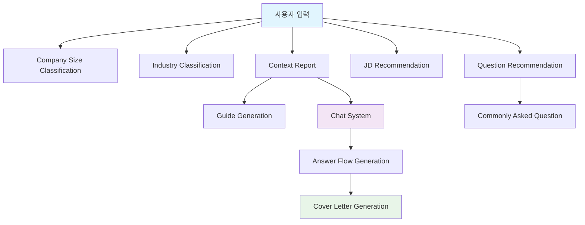

# 🔍 프롬프트 파일 분석 요약

본 문서는 jasoseo-agent 레포지토리에 있는 모든 프롬프트 파일들을 분석하여 정리한 내용입니다.

## 📁 전체 프롬프트 파일 목록

총 **10개**의 프롬프트 파일이 발견되었습니다:

1. `chat/prompt.yaml`
2. `guide_generation/prompt.yaml`
3. `jd-recommendation/prompt.yaml`
4. `answer_flow_generation/prompt.yaml`
5. `jasoseo-context-report/prompt.yaml`
6. `industry-classification/prompt.yaml`
7. `question-recommendation/prompt.yaml`
8. `company-size-classification/prompt.yaml`
9. `commonly-asked-question/prompt.yaml`
10. `jasoseo-agent/company-size-classification/prompt.yaml` (중복)

---

## 📝 각 프롬프트 파일 상세 분석

### 1. 💬 Chat Prompt (`chat/prompt.yaml`)

#### 🔑 Key: `Interviewer` (면접관 역할)
**📥 Input Variables:**
- `{company_name}`: 회사명
- `{industry}`: 산업 분야
- `{position_title}`: 모집 직무
- `{core_values}`: 핵심 인재상
- `{company_size}`: 기업 규모
- `{context_report}`: 기업 리포트
- `{jd}`: Job Description
- `{student_name}`: 학생 이름
- `{student_major}`: 전공
- `{student_status}`: 학년/졸업 여부
- `{experience_summary}`: 경험 정리
- `{questions}`: 자기소개서 질문
- `{word_limit}`: 글자수 제한
- `{guide}`: 답변 가이드
- `{conversation}`: 대화 기록

**📤 Output Format:** (JSON)
```json
{
  "reasoning_for_progress": "답변 진행 상황에 대한 이유 설명",
  "progress": 0-100,
  "answer": "AI 답변"
}
```

#### 🔑 Key: `Student` (학생 역할)
**📥 Input Variables:**
- `{company_name}`: 회사명
- `{student_name}`: 학생 이름
- `{student_major}`: 전공
- `{student_status}`: 학년/졸업 여부
- `{position_title}`: 지원 직무
- `{core_values}`: 핵심 인재상
- `{recent_issue}`: 최근 회사 이슈
- `{conversation}`: 대화 기록

**📤 Output Format:** (JSON)
```
```json
{
  "answer": "답변 (10단어 이내)"
}
\`\`\`
```

#### 🔑 Key: `CoverLetter` (자기소개서 생성)
**📥 Input Variables:**
- `{question}`: 자기소개서 질문
- `{jd}`: Job Description
- `{company_name}`: 회사명
- `{experience_level}`: 경력 수준
- `{conversation}`: 대화 내용
- `{flow_text}`: 답변 흐름 가이드라인
- `{word_limit}`: 글자수 제한

**📤 Output Format:** (Markdown)
```
```markdown
[제목]

모범답안 내용...
\`\`\`
```
---

### 2. 📋 Guide Generation (`guide_generation/prompt.yaml`)

#### 🔑 Key: `prompt` (자소서 답변 구조 생성)
**📥 Input Variables:**
- `{question}`: 자기소개서 질문
- `{jd}`: Job Description
- `{company_name}`: 회사명
- `{experience_level}`: 경력 수준

**📤 Output Format:** (Markdown Table)
```
```markdown
| 단계 | 설명 |
| --- | --- |
| ① ... | ... |
| ② ... | ... |
| ③ ... | ... |
\`\`\`
```

---

### 3. 💼 JD Recommendation (`jd-recommendation/prompt.yaml`)

#### 🔑 Key: `prompt` (JD 생성)
**📥 Input Variables:**
- `{job_title}`: 직무
- `{company_name}`: 회사명
- `{experience_level}`: 경력 수준

**📤 Output Format:** (JSON)
```
```json
{
  "recommended_jd": "직무기술서 내용"
}
\`\`\`
```

---

### 4. 📈 Answer Flow Generation (`answer_flow_generation/prompt.yaml`)

#### 🔑 Key: `prompt` (답변 흐름 생성)
**📥 Input Variables:**
- `{question}`: 자기소개서 질문
- `{jd}`: Job Description
- `{company_name}`: 회사명
- `{experience_level}`: 경력 수준
- `{conversation}`: 진행된 대화

**📤 Output Format:** (Markdown Table)
```
```markdown
| 단계 | 항목 | 설명 | 체크포인트 |
| --- | --- | --- | --- |
| ① ... | ... | ... | ... |
| ② ... | ... | ... | ... |
\`\`\`
```
---

### 5. 🏢 Context Report (`jasoseo-context-report/prompt.yaml`)

#### 🔑 Key: `prompt` (기업 및 직무 분석)
**📥 Input Variables:**
- `{job_title}`: 직무
- `{company_name}`: 회사명
- `{experience_level}`: 경력 수준

**📤 Output Format:** (JSON)
```
```json
{
  "company_profile": {
    "name": "회사명",
    "vision_mission": "비전과 미션",
    "core_values": ["핵심가치1", "핵심가치2"],
    "talent_philosophy": "인재상",
    "recent_news_summary": "최근 뉴스",
    "main_products_services": ["제품1", "제품2"]
  },
  "position_analysis": {
    "role_summary": "직무 요약",
    "keywords": ["키워드1", "키워드2"],
    "required_skills": {
      "hard": ["하드스킬1", "하드스킬2"],
      "soft": ["소프트스킬1", "소프트스킬2"]
    }
  },
  "industry_context": {
    "trends": ["트렌드1", "트렌드2"],
    "competitors": ["경쟁사1", "경쟁사2"]
  }
}
\`\`\`
```

---

### 6. 🏭 Industry Classification (`industry-classification/prompt.yaml`)

#### 🔑 Key: `prompt` (산업 분류)
**📥 Input Variables:**
- `{job_title}`: 직무
- `{company_name}`: 회사명

**📤 Output Format:** (JSON Array)
```
```json
["tagId1", "tagId2", ...]
\`\`\`
```

**🏷️ 사용 가능한 태그:**
- IT/플랫폼: `platform-portal`, `e-commerce`, `game`, `it-solution-si` 등
- 제조/하드웨어: `semiconductor`, `electronics-home`, `automotive-mobility` 등
- 금융: `bank`, `securities`, `insurance`, `card` 등
- 총 50여개의 산업 태그 제공

---

### 7. ❓ Question Recommendation (`question-recommendation/prompt.yaml`)

#### 🔑 Key: `system_prompt` (시스템 프롬프트)
**📥 Input Variables:** 없음 (시스템 설정용)

**📤 Output Format:** 없음 (시스템 설정용)

#### 🔑 Key: `user_prompt` (사용자 프롬프트)
**📥 Input Variables:**
- `{job_title}`: 직무
- `{company_name}`: 회사명
- `{experience_level}`: 경력 수준

**📤 Output Format:** (JSON)
```
```json
{
  "recommended_question": "생성된 면접 질문"
}
\`\`\`
```

---

### 8. 🏛️ Company Size Classification (`company-size-classification/prompt.yaml`)

#### 🔑 Key: `prompt_simple` (간단한 분류)
**📥 Input Variables:**
- `{company_name}`: 회사명

**📤 Output Format:** (Text)
```
카테고리명 (대기업, 중견기업, 중소기업 등)
```

#### 🔑 Key: `prompt` (상세 분석)
**📥 Input Variables:**
- `{company_name}`: 회사명

**📤 Output Format:**
```
**기업 개요:**
- 해당 기업에 대한 간단한 소개 (3-4줄)

**기업 규모 분류:** [카테고리]

**분류 근거:**
- 매출 규모: (구체적 수치 포함)
- 직원 수: (구체적 수치 포함)
- 업종/사업 영역: 
- 기타 특징:

<기업규모>
```

**📊 분류 카테고리:**
- 대기업, 중견기업, 중소기업, 스타트업
- 외국계기업, 공공기관 및 공기업
- 비영리단체 및 협회재단, 금융업

---

### 9. 🔄 Commonly Asked Question (`commonly-asked-question/prompt.yaml`)

#### 🔑 Key: `prompt` (맞춤형 면접 질문 생성)
**📥 Input Variables:**
- `{company_name}`: 회사명
- `{job_title}`: 직무
- `{experience_level}`: 경력 수준
- `{common_questions}`: 일반적인 면접 질문 리스트
- `{num_questions}`: 생성할 질문 개수

**📤 Output Format:** (JSON)
```
```json
{
  "sample_questions": [
    "질문1",
    "질문2",
    "질문3"
  ]
}
\`\`\`
```


---

## 🔄 프롬프트 간 연관관계



---

## 📊 프롬프트 키별 특성 요약

| 파일 | 키 | 입력 변수 수 | 출력 형식 | 웹검색 필요 | 주요 기능 |
|------|-----|-----------|----------|------------|-----------|
| **Chat** | Interviewer | 15개 | JSON | ❌ | 면접관 질문 생성 |
| | Student | 9개 | JSON | ❌ | 학생 답변 생성 |
| | CoverLetter | 7개 | Markdown | ❌ | 자기소개서 작성 |
| **Guide Generation** | prompt | 4개 | Markdown Table | ❌ | 답변 구조 생성 |
| **JD Recommendation** | prompt | 3개 | JSON | ❌ | JD 생성 |
| **Answer Flow** | prompt | 5개 | Markdown Table | ❌ | 답변 흐름 생성 |
| **Context Report** | prompt | 3개 | JSON | ✅ | 기업/직무 분석 |
| **Industry Class.** | prompt | 2개 | JSON Array | ✅ | 산업 분류 |
| **Question Rec.** | system_prompt | 0개 | 없음 | ❌ | 시스템 설정 |
| | user_prompt | 3개 | JSON | ❌ | 면접 질문 추천 |
| **Company Size** | prompt_simple | 1개 | Text | ✅ | 간단 기업 분류 |
| | prompt | 1개 | Mixed | ✅ | 상세 기업 분석 |
| **Common Questions** | prompt | 5개 | JSON | ✅ | 맞춤형 질문 생성 |

---

## 🎯 핵심 특징

### 1. **다양한 출력 형식**
- **JSON (8개 키)**: 구조화된 데이터 반환
- **Markdown Table (2개 키)**: 사람이 읽기 쉬운 테이블 형식
- **Markdown (1개 키)**: 자유 형식 마크다운 텍스트
- **Text (1개 키)**: 단순 텍스트
- **Mixed (1개 키)**: 혼합 형식

### 2. **웹 검색 활용**
- 5개 키에서 웹 검색 기능 활용
- 실시간 정보 반영으로 정확도 향상

### 3. **모듈화 설계**
- 각 키는 독립적 기능 수행
- 체인 형태로 연결하여 전체 워크플로우 구성

### 4. **사용자 맞춤화**
- 회사, 직무, 경력에 따른 개인화
- 구체적이고 실용적인 결과 제공

### 5. **복잡도 다양성**
- **최고 복잡도**: Chat-Interviewer (15개 변수)
- **중간 복잡도**: Chat-Student (9개), Answer Flow (5개)
- **최저 복잡도**: Company Size (1개 변수)


